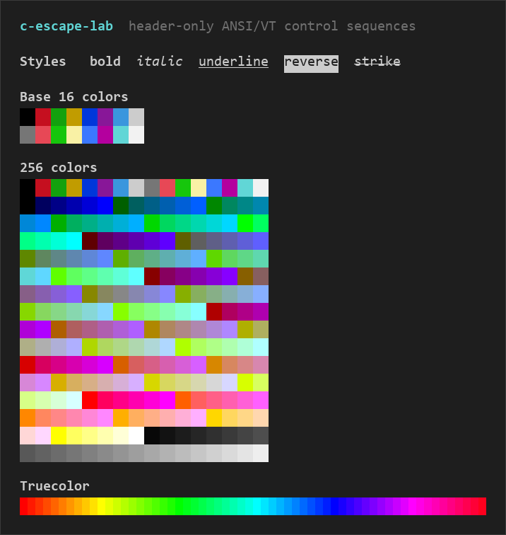

# c-escape-lab

[English](README.md) | [简体中文](README.zh-CN.md)

[](LICENSE)
[]()
[]()

A header-only ANSI/VT terminal control-sequence library: it composes control sequences into
string literals **at compile time** with C preprocessor macros, ready to pass to `printf`,
`fputs`, or any output API. No library to link.

<p align="center">
  
</p>

## Features

- **Header-only, zero dependencies**: add a single `escape.h`, nothing to link.
- **Compile-time, zero runtime cost**: every macro expands to a string literal, with no
  runtime formatting overhead.
- **Common CSI covered**: cursor movement, erasing/editing, SGR styling, mode control,
  device queries, and scrolling regions.
- **Full color support**: ANSI 16-color, 256-color (6×6×6 cube and grayscale), and truecolor.
- **Low-level builders**: `ESC` / `CSI` / `OSC` / `DCS` / `APC` for composing any sequence
  not yet wrapped.
- **GCC / Clang friendly**: primarily GNU C, with C++ support (requires `decltype`).

## Installation

Add [`escape.h`](escape.h) to your project, or point the compiler at this repository:

```sh
# Option 1: copy the header
cp path/to/c-escape-lab/escape.h .

# Option 2: point -I at the repository
cc -std=gnu11 -I path/to/c-escape-lab your.c -o your
```

Compiler requirements: GCC or Clang, preferably `-std=gnu11` (it uses GNU extensions; C++
needs `decltype` support). On Windows, MinGW-w64 `gcc` works with the same commands.

## Quick Start

```c
#include <stdio.h>
#include "escape.h"

int main(void)
{
    /* Colored text: ESCAPE_COLORIZE_SSTR appends an SGR reset after the text. */
    printf("Hello, " ESCAPE_COLORIZE_SSTR("world", EST_CSI_SGR_BOLD, EST_CSI_SGR_FC_GREEN) "!\n");

    /* 256-color foreground plus an explicit reset. */
    printf(EST_CSI_SGR_FC_EXT_256_SSTR(196) "256-color" EST_CSI_SGR_SSTR(EST_CSI_SGR_RESET) "\n");

    /* Truecolor foreground plus an explicit reset. */
    printf(EST_CSI_SGR_FC_EXT_TRUE_SSTR(255, 80, 20) "truecolor" EST_CSI_SGR_SSTR(EST_CSI_SGR_RESET) "\n");

    return 0;
}
```

Save the code above as `demo.c` (or any `.c` file), then compile and run:

```sh
cc -std=gnu11 -Wall -Wextra -pedantic demo.c -o demo
./demo
```

A fuller showcase is in [`examples/demo.c`](examples/demo.c) — the program behind the
screenshot above.

## Usage

### `_STR` vs. `_SSTR`

This is the only concept you need to understand:

- `*_STR` takes **already-composed string fragments**, such as `"5"` or `"1;10"`.
- `*_SSTR` takes **preprocessor tokens** (numbers, macro names) and stringifies them with
  `ESCAPE_S(...)` first.

```c
EST_CSI_CUU_STR("5")    /* "\x1b[5A" —— the argument is a string */
EST_CSI_CUU_SSTR(5)     /* "\x1b[5A" —— the argument is a token; same result */

EST_CSI_SGR_SSTR(EST_CSI_SGR_BOLD)   /* "\x1b[1m" */
```

### Results are compile-time literals; use `snprintf` for runtime values

Every macro expands to a **string literal**, so you cannot pass a runtime variable (such as
`int n`) directly. The recommended pattern for runtime values is to pass a format specifier
to a `_STR` macro as a string fragment, then let `snprintf` substitute the value.

```c
char buf[32];
int n = 5;
snprintf(buf, sizeof buf, EST_CSI_CUU_STR("%d"), n);  /* buf = "\x1b[5A" */
fputs(buf, stdout);
```

Why this works: `EST_CSI_CUU_STR("%d")` expands to `"\x1b[%dA"`, and `snprintf` then
substitutes `n` for `%d`.

### Capability overview

| Category | Representative macros | Notes |
| --- | --- | --- |
| Text style and color | `ESCAPE_COLORIZE_SSTR(text, ...)`, `EST_CSI_SGR_SSTR(Ps)` | Bold/italic/color/reset; 256-color and truecolor |
| Cursor movement | `EST_CSI_CUU_SSTR(n)`, `EST_CSI_CUP_SSTR(row, col)` | Up/down/left/right, absolute row/col, save/restore cursor |
| Erase and edit | `EST_CSI_EL_SSTR(2)`, `EST_CSI_ED_SSTR(2)` | Erase line/screen, insert/delete chars and lines |
| Modes and queries | `EST_CSI_SM_DEC_PRIVATE_MODE_STR("25")`, `EST_CSI_CPR_STR()` | Show/hide cursor and other modes; device-status queries |
| Low-level builders | `EST_CSI_STR(P, I, F)`, `EST_OSC_STR(S)` | Compose any sequence not yet wrapped |

See [API Reference](#api-reference) for the complete per-macro listing.

## Notes

1. **Colors and extensions depend on the terminal**: this library does not inspect
   `TERM`/`COLORTERM` and does not auto-detect, degrade, or disable color.
2. **Some sequences are terminal extensions**: `CSI s/u`, left/right margins, mouse modes,
   synchronized output, and query commands should be tested against the target terminal.
3. **Verify the bytes**: when in doubt, print the generated sequence in hex and confirm it
   starts with `0x1b` and contains the expected introducer such as `[`. Do not rely on
   terminal rendering alone.
4. `ESCAPE_COLORIZE_STR(text)` with no SGR arguments applies no styling: the prefix
   becomes an empty-parameter reset (`ESC[m`) and the trailing reset (`ESC[0m`) is still
   appended.

## API Reference

### Namespaces

| Prefix | Purpose |
| --- | --- |
| `ESCAPE_` | Preprocessor utilities, assertions, TODO handling, and numeric helpers |
| `EST_` | Sequence types, parameters, final bytes, and sequence builders |
| `EST_CSI_` | CSI sequences and their parameters |
| `ESCAPE_INTRODUCER_` | Introducers for the supported sequence families |
| `ESC_*` | ESC byte constants (hex/octal/default aliases) |
| `ESTO_*` / `EST_*` | Sequence type enums |

### ESC constants and introducers

The ESC byte has hexadecimal (`_HEX`) and octal (`_OCT`) forms; `_DEF` aliases default to
hexadecimal:

| Hexadecimal | Value | Octal | Value |
| --- | --- | --- | --- |
| `ESC_VAL_HEX` | `0x1b` | `ESC_VAL_OCT` | `033` |
| `ESC_RAW_HEX` | `\x1b` | `ESC_RAW_OCT` | `\033` |
| `ESC_CHR_HEX` | `'\x1b'` | `ESC_CHR_OCT` | `'\033'` |
| `ESC_STR_HEX` | `"\x1b"` | `ESC_STR_OCT` | `"\033"` |
| `ESC_VAL_DEF` / `ESC_RAW_DEF` / `ESC_CHR_DEF` / `ESC_STR_DEF` | alias `_HEX` | | |

Introducers:

| Macro | Expands to |
| --- | --- |
| `ESCAPE_INTRODUCER_ESC` | `ESC` |
| `ESCAPE_INTRODUCER_CSI` | `ESC [` |
| `ESCAPE_INTRODUCER_OSC` | `ESC ]` |
| `ESCAPE_INTRODUCER_DCS` | `ESC P` |
| `ESCAPE_INTRODUCER_APC` | `ESC _` |
| `ESCAPE_INTRODUCER_ST` | `ESC \` |
| `ESCAPE_INTRODUCER_SOS` | `ESC X` |
| `ESCAPE_INTRODUCER_PM` | `ESC ^` |

### Low-level builders

| Macro | Form |
| --- | --- |
| `EST_ESC_STR(_I, F)` | `ESC _I F` |
| `EST_ESC_NOI_STR(F)` | `ESC F` |
| `EST_CSI_STR(_P, _I, F)` | `CSI _P _I F` |
| `EST_CSI_NOP_STR(_I, F)` | `CSI _I F` (omit parameters) |
| `EST_CSI_NOI_STR(_P, F)` | `CSI _P F` (omit intermediate bytes) |
| `EST_CSI_NOPI_STR(F)` | `CSI F` (omit parameters and intermediate bytes) |
| `EST_OSC_STR(S)` | `OSC S ST` |
| `EST_DCS_STR(_P, _I, F, D)` | `DCS _P _I F D ST` |
| `EST_DCS_NOP_STR(_I, F, D)` | `DCS _I F D ST` (omit parameters) |
| `EST_DCS_NOI_STR(_P, F, D)` | `DCS _P F D ST` (omit intermediate bytes) |
| `EST_DCS_NOPI_STR(F, D)` | `DCS F D ST` (omit parameters and intermediate bytes) |
| `EST_APC_STR(D)` | `APC D ST` |
| `EST_ST_STR()` | `ST` |
| `EST_SOS_STR(D)` / `EST_PM_STR(D)` | `SOS D ST` / `PM D ST` |

> OSC / DCS / APC / ESC currently provide low-level builders only, with no semantic
> wrappers yet (e.g. window title, `DECRQSS`); single-character ESC wrappers, query-response
> parsing, and terminal-capability detection are also not provided.

### Type enums

`ESCAPE_SEQUENCE_TYPE` (with `ESCAPE_SEQUENCE_TYPE_ORDER`) reserves numbered blocks for
each sequence family using `EST_BLOCK_OFFSET = 0x0100`:

| Family | Order enum | Type enum | Value |
| --- | --- | --- | --- |
| ESC | `ESTO_ESC` | `EST_ESC` | `0x100` |
| CSI | `ESTO_CSI` | `EST_CSI` | `0x200` |
| OSC | `ESTO_OSC` | `EST_OSC` | `0x300` |
| DCS | `ESTO_DCS` | `EST_DCS` | `0x400` |
| APC | `ESTO_APC` | `EST_APC` | `0x500` |
| ST | `ESTO_ST` | `EST_ST` | `0x600` |
| SOS | `ESTO_SOS` | `EST_SOS` | `0x700` |
| PM | `ESTO_PM` | `EST_PM` | `0x800` |

`EST_CSI_TYPE` lists every CSI type (`CUU`, `CUD` … `DECRQM`) starting from `EST_CSI`
(`0x200`), ending with `EST_CSI_END` / `EST_CSI_NUMS`. These enums currently reserve numbers
and self-describe the types; the sequence strings are still produced by the macros below.

### CSI: cursor / erase / scroll

The `_SSTR` and `_DEFAULT` columns mark whether that variant exists (`✓` yes / `—` no).
`_DEFAULT_STR` explicitly inserts the protocol's default parameter (cursor moves default to
`1`, erase/edit to `0` or `1`, `TBC` to `0`, `DECSCUSR`/`DECSCA` to `0`).

| Macro (`_STR` form) | `_SSTR` | `_DEFAULT` | Produces | Meaning |
| --- | --- | --- | --- | --- |
| `EST_CSI_CUU_STR(Ps)` | ✓ | ✓ | `CSI Ps A` | Move up |
| `EST_CSI_CUD_STR(Ps)` | ✓ | ✓ | `CSI Ps B` | Move down |
| `EST_CSI_CUF_STR(Ps)` | ✓ | ✓ | `CSI Ps C` | Move right |
| `EST_CSI_CUB_STR(Ps)` | ✓ | ✓ | `CSI Ps D` | Move left |
| `EST_CSI_CNL_STR(Ps)` | ✓ | ✓ | `CSI Ps E` | Move down to line beginning |
| `EST_CSI_CPL_STR(Ps)` | ✓ | ✓ | `CSI Ps F` | Move up to line beginning |
| `EST_CSI_CHA_STR(Ps)` | ✓ | ✓ | `CSI Ps G` | Set absolute column |
| `EST_CSI_CUP_STR(Pr, Pc)` | ✓ | ✓ | `CSI Pr;Pc H` | Set row and column |
| `EST_CSI_HVP_STR(Pr, Pc)` | ✓ | ✓ | `CSI Pr;Pc f` | Horizontal/vertical position |
| `EST_CSI_VPA_STR(Ps)` | ✓ | ✓ | `CSI Ps d` | Set absolute row |
| `EST_CSI_CHT_STR(Ps)` | ✓ | ✓ | `CSI Ps I` | Forward tab |
| `EST_CSI_CBT_STR(Ps)` | ✓ | ✓ | `CSI Ps Z` | Backward tab |
| `EST_CSI_SCP_STR()` | ✓ | — | `CSI s` | Save cursor (reused by DECSLRM when `?69` is on) |
| `EST_CSI_RCP_STR()` | ✓ | — | `CSI u` | Restore cursor (may be taken by extensions on some terminals) |
| `EST_CSI_DECSC_STR()` | ✓ | — | `ESC 7` | DEC save cursor |
| `EST_CSI_DECRC_STR()` | ✓ | — | `ESC 8` | DEC restore cursor |
| `EST_CSI_ED_STR(Ps)` | ✓ | ✓ | `CSI Ps J` | Erase in display: `0` to end, `1` to start, `2` all, `3` scrollback |
| `EST_CSI_EL_STR(Ps)` | ✓ | ✓ | `CSI Ps K` | Erase in line: `0` to end, `1` to start, `2` whole line |
| `EST_CSI_ICH_STR(Ps)` | ✓ | ✓ | `CSI Ps @` | Insert blank characters |
| `EST_CSI_DCH_STR(Ps)` | ✓ | ✓ | `CSI Ps P` | Delete characters |
| `EST_CSI_ECH_STR(Ps)` | ✓ | ✓ | `CSI Ps X` | Erase characters without moving the cursor |
| `EST_CSI_IL_STR(Ps)` | ✓ | ✓ | `CSI Ps L` | Insert lines |
| `EST_CSI_DL_STR(Ps)` | ✓ | ✓ | `CSI Ps M` | Delete lines |
| `EST_CSI_SU_STR(Ps)` | ✓ | ✓ | `CSI Ps S` | Scroll up |
| `EST_CSI_SD_STR(Ps)` | ✓ | ✓ | `CSI Ps T` | Scroll down |
| `EST_CSI_REP_STR(Ps)` | ✓ | ✓ | `CSI Ps b` | Repeat previous character |
| `EST_CSI_SGR_STR(Ps)` | ✓ | — | `CSI Ps m` | Select graphic rendition (style/color) |
| `EST_CSI_SM_STR(Ps)` | ✓ | — | `CSI Ps h` | Set mode |
| `EST_CSI_RM_STR(Ps)` | ✓ | — | `CSI Ps l` | Reset mode |
| `EST_CSI_DSR_STR()` | — | — | `CSI 5 n` | Device status report |
| `EST_CSI_CPR_STR()` | — | — | `CSI 6 n` | Cursor position report |
| `EST_CSI_DA1_STR()` | — | — | `CSI 0 c` | Primary device attributes |
| `EST_CSI_DA2_STR()` | — | — | `CSI >0 c` | Secondary device attributes |
| `EST_CSI_XTVERSION_STR()` | — | — | `CSI >0 q` | xterm version |
| `EST_CSI_DECSTBM_STR(Pt, Pb)` | — | — | `CSI Pt;Pb r` | Set top/bottom margins |
| `EST_CSI_DECSLRM_STR(Pl, Pr)` | — | — | `CSI Pl;Pr s` | Set left/right margins (needs `?69h` first) |
| `EST_CSI_TBC_STR(Ps)` | — | ✓ | `CSI Ps g` | Clear tab stop: `0` current, `3` all |
| `EST_CSI_DECSTR_STR()` | — | — | `CSI ! p` | Soft terminal reset |
| `EST_CSI_DECSCUSR_STR(Ps)` | — | ✓ | `CSI Ps SP q` | Cursor style (`0` blink block, `1` block, `2` steady block, `3` underline, `4` steady underline, `5` bar, `6` steady bar) |
| `EST_CSI_DECSCA_STR(Ps)` | — | ✓ | `CSI Ps " q` | Selective-erase protection (`0` erasable, `1` protected, `2` same as `0`) |
| `EST_CSI_DECRQM_STR(Ps)` | — | — | `CSI Ps $ p` | Request mode (wrappers below) |

### SGR styles and colors

Style attribute constants (use with `EST_CSI_SGR_SSTR(Ps)`):

| Macro | Value | Meaning |
| --- | --- | --- |
| `EST_CSI_SGR_RESET` / `NORMAL` | 0 | Reset |
| `EST_CSI_SGR_BOLD` / `INCREASED_INTENSITY` | 1 | Bold |
| `EST_CSI_SGR_FAINT` / `DECREASED_INTENSITY` | 2 | Faint |
| `EST_CSI_SGR_ITALIC` | 3 | Italic |
| `EST_CSI_SGR_UNDERLINE` | 4 | Underline |
| `EST_CSI_SGR_SLOW_BLINK` | 5 | Slow blink |
| `EST_CSI_SGR_RAPID_BLINK` | 6 | Rapid blink |
| `EST_CSI_SGR_REVERSE_VIDEO` / `SWAP_FORE_BACK` | 7 | Reverse video |
| `EST_CSI_SGR_HIDE` / `CONCEAL` | 8 | Conceal |
| `EST_CSI_SGR_STRIKE` / `CROSSED_OUT` | 9 | Strikeout |
| `EST_CSI_SGR_DOUBLY_UNDERLINE` | 21 | Double underline |
| `EST_CSI_SGR_NOT_BOLD` / `NORMAL_INTENSITY` | 22 | Not bold |
| `EST_CSI_SGR_NOT_ITALIC` | 23 | Not italic |
| `EST_CSI_SGR_NOT_UNDERLINE` | 24 | Not underlined |
| `EST_CSI_SGR_NOT_BLINKING` | 25 | Not blinking |
| `EST_CSI_SGR_PROPORTIONAL_SPACING` | 26 | Proportional spacing |
| `EST_CSI_SGR_NOT_REVERSED` | 27 | Not reversed |
| `EST_CSI_SGR_REVEAL` / `NOT_HIDDEN` | 28 | Reveal |
| `EST_CSI_SGR_NOT_STRIKE` / `NOT_CROSSED_OUT` | 29 | Not struck out |
| `EST_CSI_SGR_NOT_PROPORTIONAL_SPACING` | 50 | Not proportional spacing |

Color constants (by category):

| Category | Macro prefix | Values |
| --- | --- | --- |
| Foreground | `EST_CSI_SGR_FC_*` | `30–37` (black/red/green/yellow/blue/magenta/cyan/white), `38` extended, `39` default |
| Background | `EST_CSI_SGR_BC_*` | `40–47`, `48` extended, `49` default |
| Underline color | `EST_CSI_SGR_UC_*` | `58` extended, `59` default |
| Bright foreground | `EST_CSI_SGR_BFC_*` | `90–97` |
| Bright background | `EST_CSI_SGR_BBC_*` | `100–107` |

Extended-color builders:

| Macro | Produces |
| --- | --- |
| `EST_CSI_SGR_COLOR_EXT_STR(m1, m2, c)` | `CSI m1;m2;c m` |
| `EST_CSI_SGR_256_COLOR_EXT_STR(m, n)` | `CSI m;5;n m` |
| `EST_CSI_SGR_TRUE_COLOR_EXT_STR(m, r, g, b)` | `CSI m;2;r;g;b m` |
| `EST_CSI_SGR_FC_EXT_256_STR(n)` / `_SSTR(n)` | `CSI 38;5;n m` |
| `EST_CSI_SGR_BC_EXT_256_STR(n)` / `_SSTR(n)` | `CSI 48;5;n m` |
| `EST_CSI_SGR_UC_EXT_256_STR(n)` / `_SSTR(n)` | `CSI 58;5;n m` |
| `EST_CSI_SGR_FC_EXT_TRUE_STR(r, g, b)` / `_SSTR(r, g, b)` | `CSI 38;2;r;g;b m` |
| `EST_CSI_SGR_BC_EXT_TRUE_STR(r, g, b)` / `_SSTR(r, g, b)` | `CSI 48;2;r;g;b m` |
| `EST_CSI_SGR_UC_EXT_TRUE_STR(r, g, b)` / `_SSTR(r, g, b)` | `CSI 58;2;r;g;b m` |

> `_STR` forms accept string fragments only (e.g. `"196"`, `"255"`); use `_SSTR` for tokens
> or numeric literals.

256-color helpers:

| Macro | Purpose |
| --- | --- |
| `EST_CSI_SGR_256_COLOR_*` | Base colors `0..7`, bright colors `8..15` |
| `EST_CSI_SGR_256_COLOR_CUBE_INDEX(r, g, b)` | 6×6×6 cube index `16..231` |
| `EST_CSI_SGR_256_COLOR_CUBE_LEVEL_R/G/B(index)` | Decompose an index into channel levels `0..5` |
| `EST_CSI_SGR_256_COLOR_CUBE_R/G/B(level)` | Level → real RGB component (table `{0, 95, 135, 175, 215, 255}`) |
| `EST_CSI_SGR_256_COLOR_GRAYSCALE_INDEX(v)` | Gray value → index `232..255` |
| `EST_CSI_SGR_256_COLOR_GRAYSCALE_GRAY/R/G/B(index)` | Index → gray value |
| `EST_CSI_SGR_256_COLOR_CUBE_*_IN_RANGE(...)` / `GRAYSCALE_*_IN_RANGE(...)` | Range check macros |

### Modes and queries

Mode parameter constants (for `SM`/`RM`):

| Macro | Value | Meaning |
| --- | --- | --- |
| `EST_CSI_SM_RM_IRM` | 4 | Insert mode (ANSI standard) |
| `EST_CSI_SM_RM_LNM` | 20 | Line-feed/new-line mode (ANSI standard) |
| `EST_CSI_SM_RM_DECCKM` | 1 | Cursor key mode |
| `EST_CSI_SM_RM_DECCOLM` | 3 | 132-column mode |
| `EST_CSI_SM_RM_DECSCNM` | 5 | Reverse video screen |
| `EST_CSI_SM_RM_DECOM` | 6 | Origin mode |
| `EST_CSI_SM_RM_DECAWM` | 7 | Auto-wrap |
| `EST_CSI_SM_RM_DECTCEM` | 25 | Show cursor |
| `EST_CSI_SM_RM_MODE_47` | 47 | Alternate screen |
| `EST_CSI_SM_RM_DECLRMM` | 69 | Left/right margin mode |
| `EST_CSI_SM_RM_MODE_1000/1002/1003/1004/1006` | 1000/1002/1003/1004/1006 | Mouse reporting |
| `EST_CSI_SM_RM_MODE_1047/1048/1049` | 1047/1048/1049 | Alternate screen |
| `EST_CSI_SM_RM_MODE_2004` | 2004 | Bracketed paste |
| `EST_CSI_SM_RM_MODE_2026` | 2026 | Synchronized output |

Semantic wrappers:

| Macro | Produces |
| --- | --- |
| `EST_CSI_SM_ANSI_STANDARD_MODE_STR(Ps)` | `CSI Ps h` |
| `EST_CSI_SM_DEC_PRIVATE_MODE_STR(Ps)` | `CSI ? Ps h` |
| `EST_CSI_RM_ANSI_STANDARD_MODE_STR(Ps)` | `CSI Ps l` |
| `EST_CSI_RM_DEC_PRIVATE_MODE_STR(Ps)` | `CSI ? Ps l` |
| `EST_CSI_DECRQM_ANSI_STANDARD_MODE_STR(Ps)` | `CSI Ps $ p` |
| `EST_CSI_DECRQM_DEC_PRIVATE_MODE_STR(Ps)` | `CSI ? Ps $ p` |

These semantic wrappers currently provide `_STR` forms only. The `?` in a private-mode
sequence appears once at the start of the parameter list: for multiple modes, pass one
composed string such as `EST_CSI_SM_DEC_PRIVATE_MODE_STR("25;2004")`; do not repeat `?`
before each parameter.

### General utility macros

| Category | Macros | Purpose |
| --- | --- | --- |
| Stringize / paste | `ESCAPE_S` / `ESCAPE_C` | Expand before stringizing / token pasting |
| Argument dispatch | `ESCAPE_X` / `ESCAPE_X_ARG_CNT` | Select a macro by argument count (0–7) |
| Joining | `ESCAPE_JOIN` / `ESCAPE_JOINS` | Join string arguments / stringify before joining |
| Semicolon join | `ESCAPE_JOIN_SEMICOLON` / `ESCAPE_JOINS_SEMICOLON` | Same, with `;` as the fixed separator |
| RGB | `ESCAPE_RGB` / `ESCAPE_SRGB` | Compose `r;g;b` |
| Numeric | `ESCAPE_MIN` / `ESCAPE_MAX` / `ESCAPE_CLAMP` / `ESCAPE_IN_RANGE` / `ESCAPE_ROUND_DIV` | Common numeric operations |
| Diagnostics | `ESCAPE_ASSERT` / `ESCAPE_TODO` | Write to `stderr` and `abort()` |
| Misc | `ESCAPE_EMPTY` / `ESCAPE_APPLY` / `ESCAPE_TYPEOF` | No-op / apply a macro / type deduction |

`ESCAPE_SAFE_*` variants first store their arguments to avoid repeated evaluation (they rely
on the GNU statement-expression extension); the default aliases `ESCAPE_MIN`, `ESCAPE_MAX`,
and similar point to the `UNSAFE` forms, so be careful with side-effecting expressions.

### Compatibility macros

| Macro | Purpose |
| --- | --- |
| `ESCAPE_COMPAT_HAS_VA_OPT` | Whether `__VA_OPT__` is available |
| `ESCAPE_COMPAT_COMMA_VA_ARGS` / `ESCAPE_COMMA_VA_ARGS` | Empty-varargs comma compatibility (`__VA_OPT__` or `##__VA_ARGS__`) |
| `ESCAPE_COMPAT_TYPEOF` / `ESCAPE_TYPEOF` | `typeof` / `decltype` compatibility |
| `ESCAPE_DEBUG` | Debug switch, defaults to `1` (currently reserved) |

## Contributing

Issues and pull requests are welcome. For new macros, follow the existing naming convention
(`ESCAPE_*` / `EST_*` / `EST_CSI_*`) and keep the API Reference above in sync.

## License

[MIT](LICENSE) © 2026 paopol

## References

- [ECMA-48](https://www.ecma-international.org/publications-and-standards/standards/ecma-48/): the foundational control-function encoding standard.
- [Xterm Control Sequences](https://invisible-island.net/xterm/ctlseqs/ctlseqs.html): xterm extensions and terminal-specific behavior.
